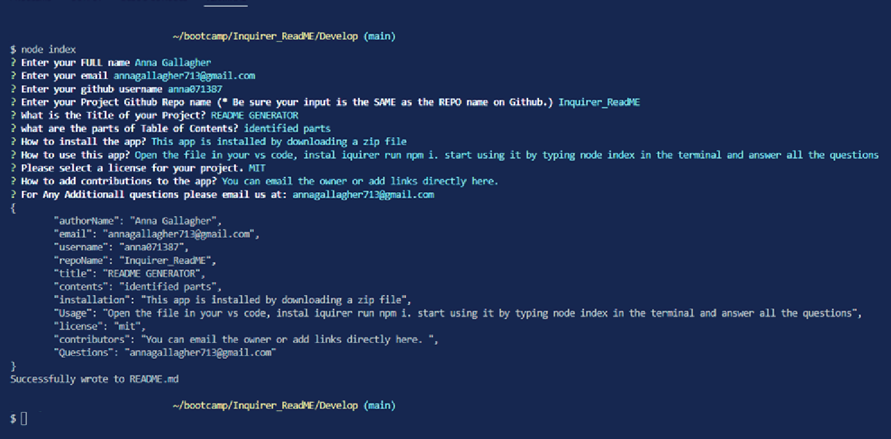

  # README GENERATOR

  
  
  
  

  ## Table of Content
    * [Links](#Project-Links)
    * [Screenshots](#Screenshots)
    * [Description](#Description)
    * [User Story](#User-Story)
    * [Installation](#Installation)
    * [Usage](#Usage)
    * [License](#License)
    * [Contributing ](#Contributing)
    * [Questions](#Questions)
  #

  ## Screenshots

  

  ## Description
    This README GEnerator is designed to help anyone to create complete readme files at fraction of time. So you can concentrate on the important things. 
    
  ## User Story
    Creating a readmefile can be a time consuming espessially when trying to create all the assets. As a user I want to create a professional readme file that includes connection to the repository to follow ,  languages specifications used, nadges for licenses, title of the project, table of contents, space to include screen shots and gifs, etc. 

  ## Installation
    This app is installed by downloading a zip file

  ## Usage 
    undefined
  
  ## Technologies 
    undefined

  ## License
    This project is [MIT](https://choosealicense.com/licenses/mit/) licensed. 
    
  ## Contribution
    undefined
  
  ## Tests
    undefined

  ## Questions
    Contact the author with any questions! 
    Github link: [anna071387](https://github.com/anna071387) 
    Email: annagallagher713@gmail.com

    